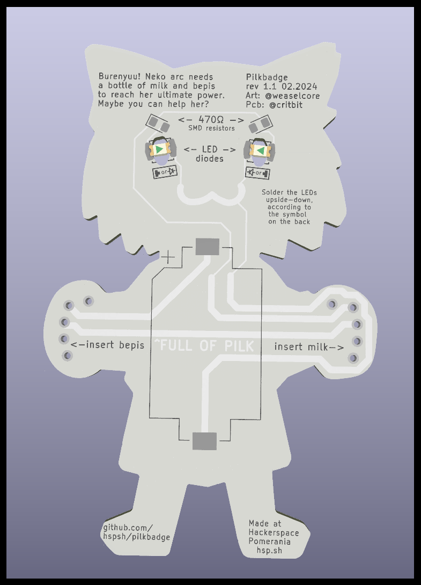
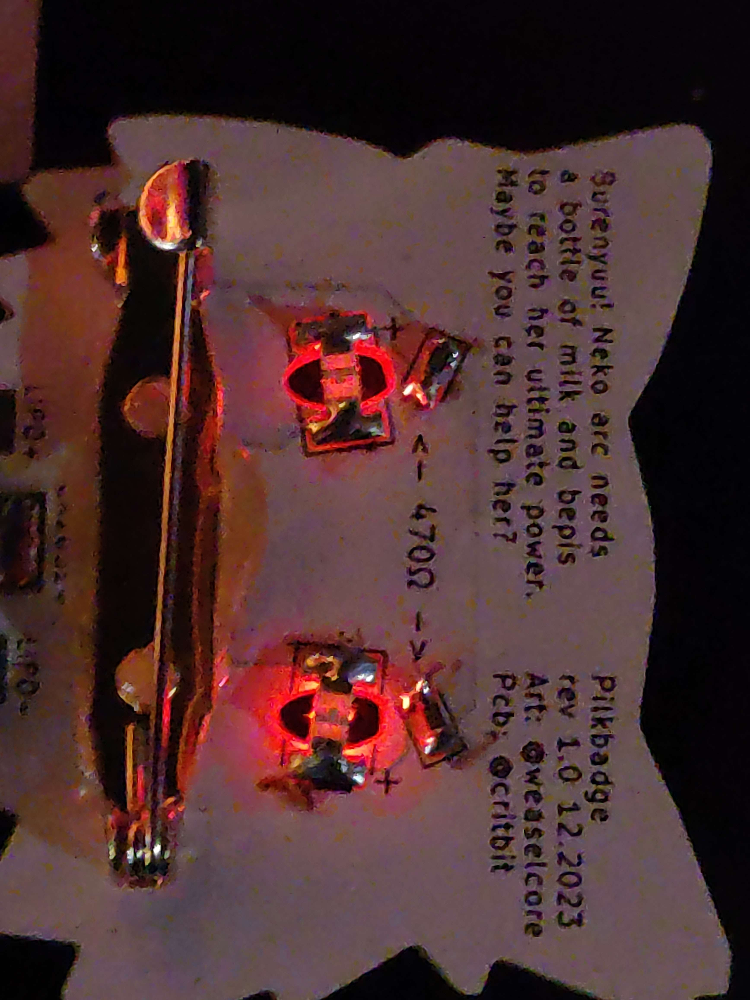
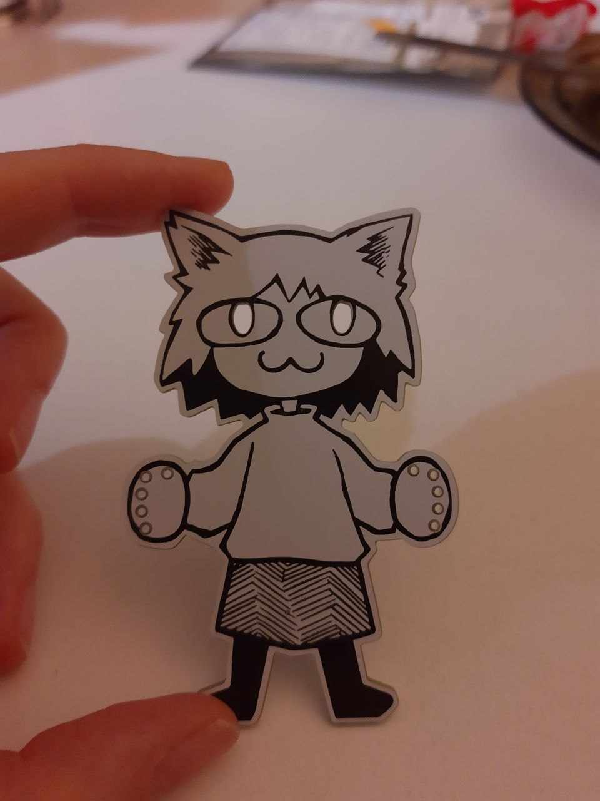
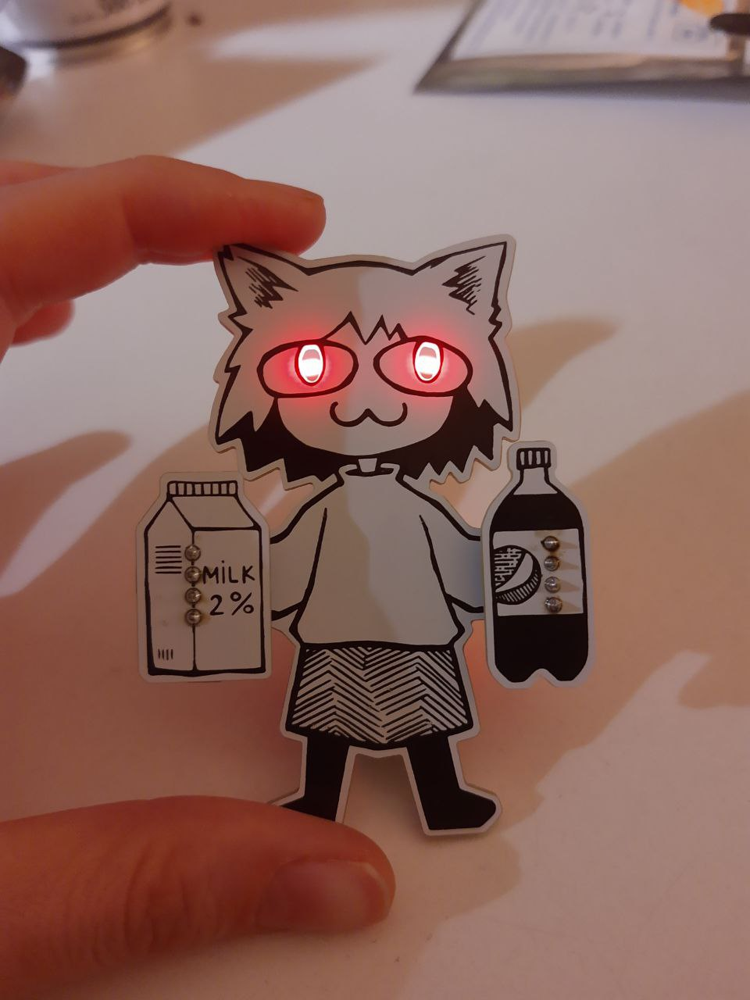
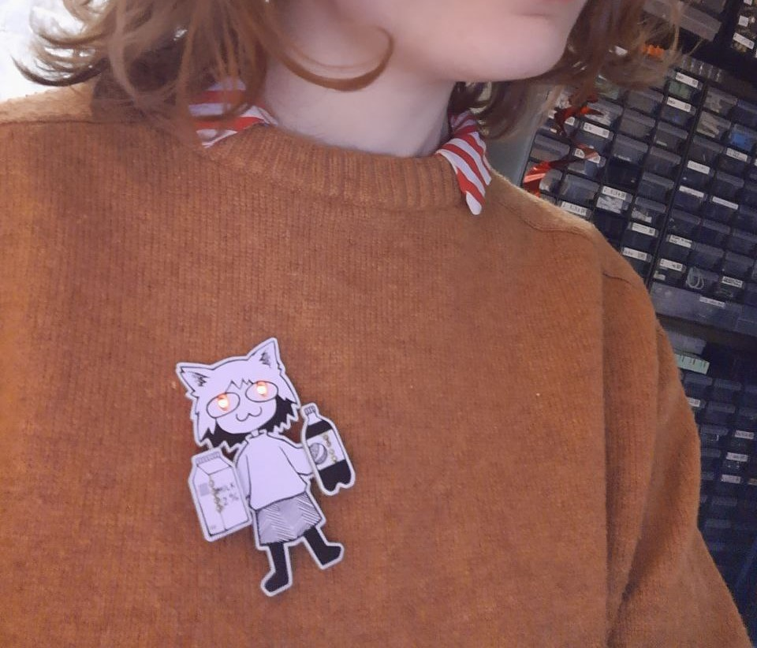
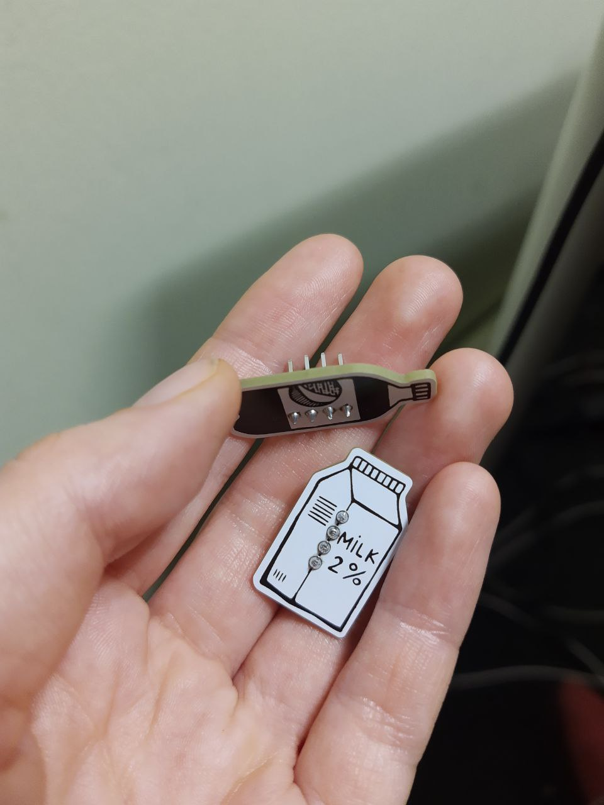

# PILKBADGE

Buranyaaa! If you love ironically drinking pilk (50% pepsi, 50% milk mix), or like anime women, this badge is for you!

This is a fun project we did at hackerspace. @weaselcore did the art, @critbit made it into a PCB.

After inserting the bottles, the eyes glow up. Inserting bottles requires a bit of wiggling, since the holes are a bit skewed - after inserting, they more-or-less stay in place.

## how to assemble your badge

You will need:
* 1x Pilkbadge neko
* 1x milk bottle, 1x bepis bottle
* 2x LEDs, size `0603` or `0805` (soldered upside-down)
* 2x `0603` resistors, value between 470 and 200 ohm (the brightest)
* 2x 4pin 2.54mm headers (soldered to the bottles)
* a generic CR2032 battery holder
* a glued-in pin (optional)

  

On 1st revision board, there's also an option for using a LiPo charger PCB instead of CR2032 holder, but this is not supported, nor advised. Do it on your own risk.

## Images
 

 

## Credits
* Random person from CCC, whose name I will never know, but they noticed an error in previos readme. They also liked being called random person, I think. You can always open an issue, random person, to become a non-random one. Thanks!
* Another random person who suggested that Neko Arc could also hold other items than pilk ingridients - we might add this feature in future revisions.
